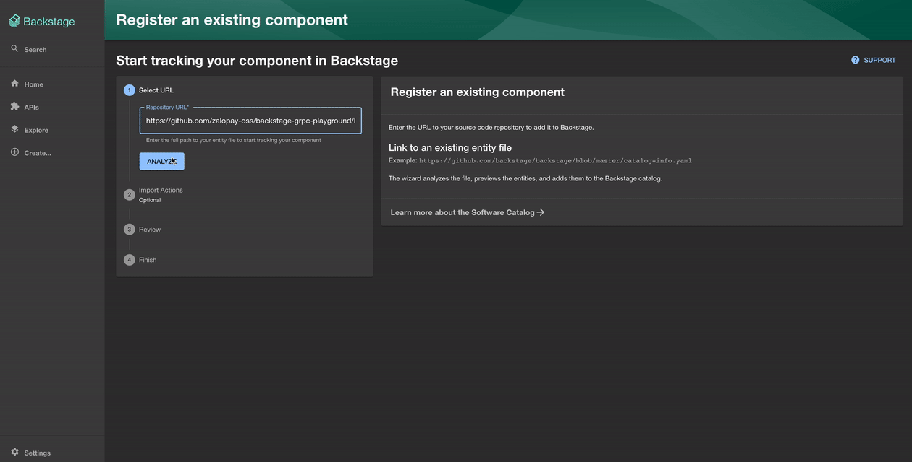
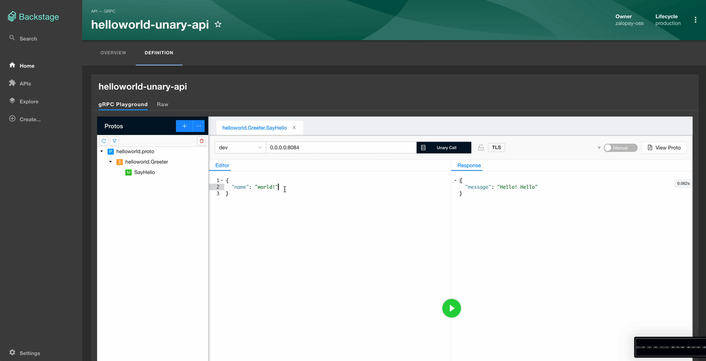

# backstage-grpc-playground

   

<!-- TOC -->
- [**Overview**](#overview)
- [**Changelog**](#changelog)
- [**Requirements**](#requirements)
- [**Methods supported**](#methods-supported)
- [**Not supported**](#not-supported-yet)
- [**Install**](#install)
- [**Usage**](#usage)
- [**Compare to BloomRPC**](#compare-to-bloomrpc)
- [**Yaml file definition**](#yaml-file-definition)
- [**Examples**](#examples)
- [**Acknowledgements**](#acknowledgements)

## Overview

**backstage-grpc-playground** is a [backstage](https://backstage.io) plugin ported from [BloomRPC](https://github.com/bloomrpc/bloomrpc) which is an Electron application. We modified some of the original code to make this compatible with Backstage entity. See [Compare to BloomRPC](#compare-to-bloomrpc)

This repo contains React frontend plugin. For the backend plugin, please checkout [backstage-grpc-playground-backend](https://github.com/zalopay-oss/backstage-grpc-playground-backend.git)

## Changelog

View [Full changelog](CHANGELOG.md)

## Requirements

- Backstage ^1.1.0
- Node.JS 14 | 16

## Methods supported

- Unary
- Client streaming
- Server streaming

## Not supported (yet)

We are currently not supporting

- SSL call [See issue](https://github.com/zalopay-oss/backstage-grpc-playground/issues/1)
- Load proto from reflection. [See issue](https://github.com/zalopay-oss/backstage-grpc-playground/issues/2)

## Install

Install backstage-grpc-playground for `packages/app`

E.g: In your backstage project root

```zsh
yarn --cwd packages/app add backstage-grpc-playground
```

## Usage

#### Customize ApiDoc to use **backstage-grpc-playground** for `grpc` type

```typescript
// packages/app/src/apis.ts
import { GrpcPlaygroundComponent } from 'backstage-grpc-playground';

// your code
// ...

export const apis: AnyApiFactory[] = [
  // other apis 
  // ...
  
  createApiFactory({
    api: apiDocsConfigRef,
    deps: {},
    factory: () => {
      // load the default widgets
      const definitionWidgets = defaultDefinitionWidgets();

      return {
        getApiDefinitionWidget: (apiEntity: ApiEntity) => {
          // custom rendering for grpc
          if (apiEntity.spec.type === 'grpc') {
            return {
              type: 'grpc',
              title: 'gRPC Playground',
              component: GrpcPlaygroundComponent
            }
          }
          
          // fallback to the defaults
          return definitionWidgets.find(d => d.type === apiEntity.spec.type);
        },
      };
    },
  }),
]
```

#### A path `/grpc-playground` in backstage application

```tsx
// packages/app/src/App.tsx
import { GrpcPlaygroundPage } from 'backstage-grpc-playground'

// your code
// ...

const routes = (
  <FlatRoutes>
    // other routes 
    // ...
    <Route path="/grpc-playground" element={<GrpcPlaygroundPage />} />
  </FlatRoutes>
);
```

Example importing API definition from Github [examples/yaml-definition/unary.yaml](https://github.com/zalopay-oss/backstage-grpc-playground/blob/main/examples/yaml-definition/unary.yaml)



## Compare to BloomRPC

- Load proto files from [defined entity spec](#yaml-file-definition) (learn more at [examples](#examples)), creating clients and send gRPC requests at [backstage backend](https://github.com/zalopay-oss/backstage-grpc-playground-backend.git)
- Proto files are contained in backend (default /packages/backend/proto)
- Able to view document generated as markdown with protoc-gen-doc integrated in backend plugin. See [example](#examples)
- Removed "Import from server reflection" [See issue](https://github.com/zalopay-oss/backstage-grpc-playground/issues/2)
- Removed "Add import paths" button
- Removed "gRPC-web" switch
- Missing imports warning, allow user to upload folder
  - User upload a file "employee.proto" that imports "common.proto"
  

  - User upload a file "account.proto" that imports some google-apis proto files. In this case user should import google folder
  

## Yaml file definition

See [yaml-definition](examples/yaml-definition/README.md)

## Examples

#### View document

See [example](https://github.com/zalopay-oss/backstage-grpc-playground/pull/4)

#### Unary



See [example](examples/unary/README.md)

#### Stream


See [example](examples/stream/README.md)

## Acknowledgements

- Thanks to [Backstage Team](https://github.com/backstage/backstage) for creating an incredible framework
- Thanks to the authors of the awesome [BloomRPC Application](https://github.com/bloomrpc/bloomrpc)
- Feel free to [submit new issues](https://github.com/zalopay-oss/backstage-grpc-playground/issues/new)
